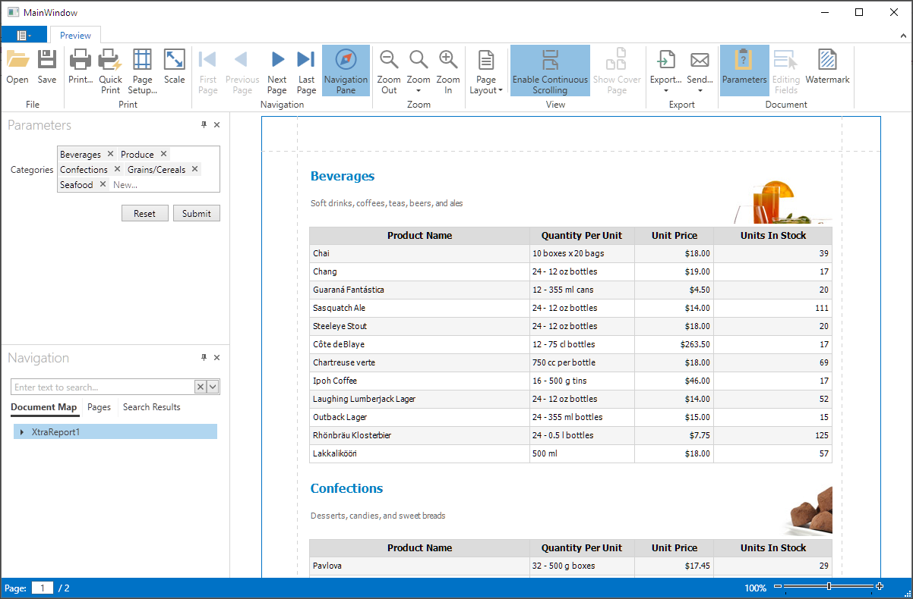

<!-- default badges list -->

<!-- default badges end -->
# Reporting for WPF - Custom Editors for Report Parameters

This example invokes a custom [ComboBoxEdit](https://docs.devexpress.com/WindowsForms/DevExpress.XtraEditors.ComboBoxEdit) editor for a multi-value report parameter.

To implement a custom parameter editor, create a custom parameter template selector and assign it to the [ParameterTemplateSelector](https://docs.devexpress.com/WPF/DevExpress.Xpf.Printing.Parameters.ParametersPanel.ParameterTemplateSelector) property of the of the [DocumentPreviewControl](https://docs.devexpress.com/WPF/DevExpress.Xpf.Printing.DocumentPreviewControl)‘s [ParametersPanel](https://docs.devexpress.com/WPF/DevExpress.Xpf.Printing.Parameters.ParametersPanel). 

The custom parameters template selector extends the base [ParameterTemplateSelector](https://docs.devexpress.com/WPF/DevExpress.Xpf.Printing.Parameters.ParameterTemplateSelector) class, and specifies a custom editor template for the multivalue parameter.

## Files to Review

* [CustomParameterTemplateSelector.cs](./CS/CustomParameterEditorsWPF/CustomParameterTemplateSelector.cs) (VB: [CustomParameterTemplateSelector.vb](./VB/CustomParameterEditorsWPF/CustomParameterTemplateSelector.vb))
* [MainWindow.xaml](./CS/CustomParameterEditorsWPF/MainWindow.xaml) (VB: [MainWindow.xaml](./VB/CustomParameterEditorsWPF/MainWindow.xaml))

## Documentation

* [Custom Editors for Report Parameters](https://docs.devexpress.com/XtraReports/17763/wpf-reporting/wpf-reporting-document-preview/api-and-customization/provide-custom-editors-for-report-parameters)

<!-- feedback -->
## Does this example address your development requirements/objectives?

 

(you will be redirected to DevExpress.com to submit your response)
<!-- feedback end -->
